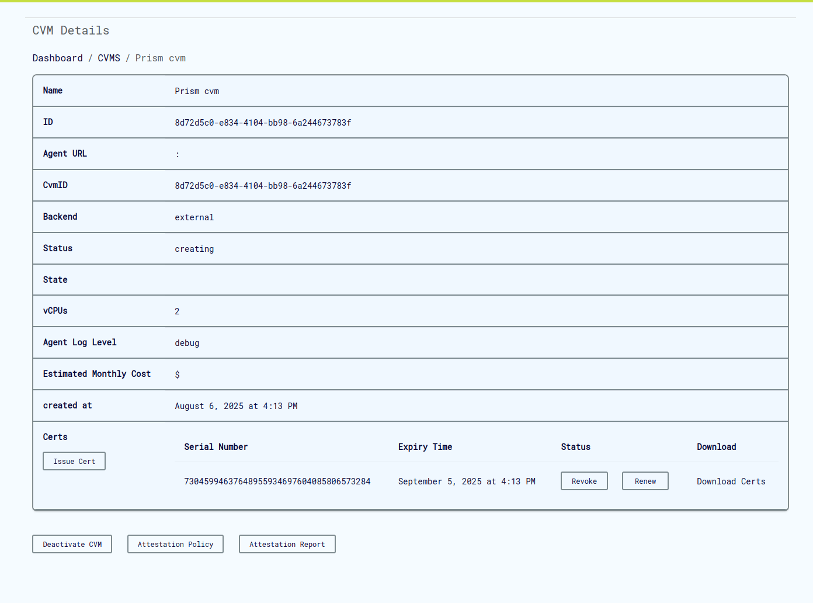
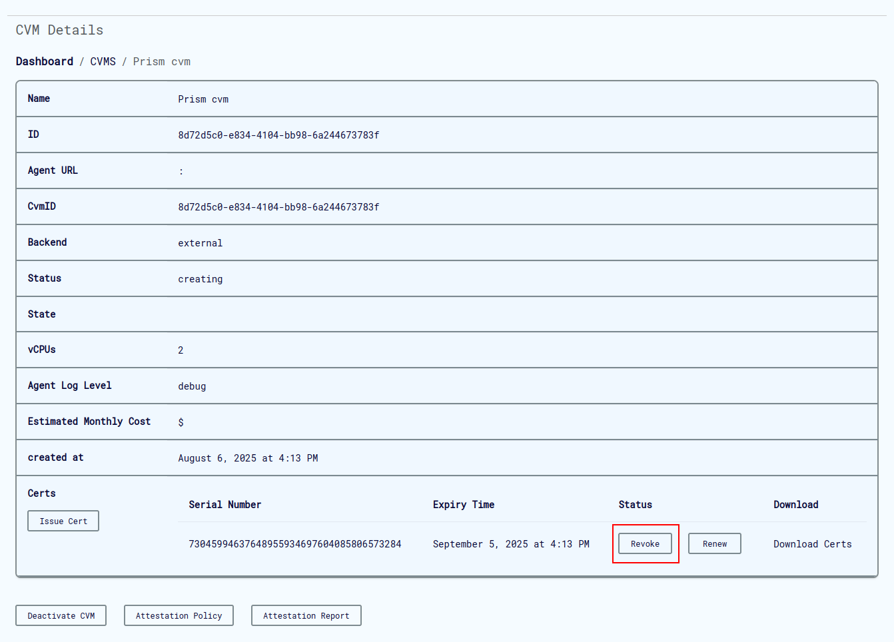

# Certs Service

The certs service is a certificate authority used to issue certs related to CVMs service for mutual and mutual attested TLS purposes. The certs service provides the ability to issue, renew, revoke and download certificates.

## Issue a Certificate

This is the creation of a certificate associated with a specific backend.

This can be done on the UI on the specific backend page, by clicking on issue cert button.

## Download a Certificate

This is a two step process. First we'll obtain a short lived token. Then using this token we'll be able to download the zip file containing the associated cert.

On the UI we'll click on request download button, followed by download certs to obtain the certs.

This results in three files `ca.pem`, `cert.pem` and `key.pem` which we'll use with CoCo's manager to bring the backend online.

## Renew Certificate

Certificates can be renewed before they expire. This will move their expiry date to a future one.

## Revoke Certificate

Certificates can be revoked, which means they can no longer be used for connecting to CVMs service. Revoked certificates cannot be renewed.

## Online Certificate Status Protocal

The certs service also provides an endpoint on `prism.ultraviolet.rs/certs/ocsp` which allows verification of certificates issued by this service.
