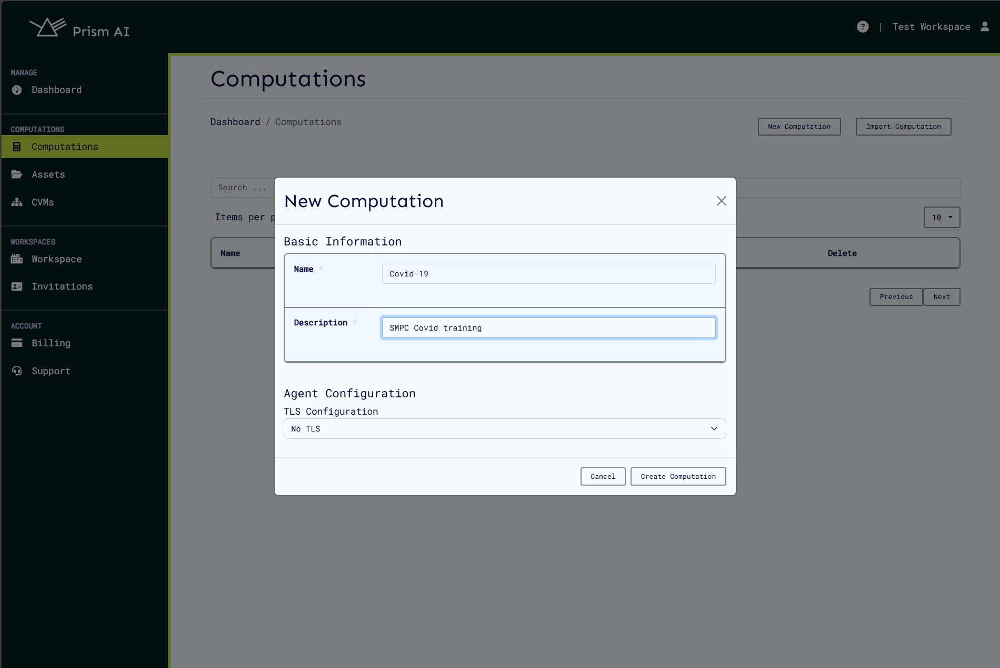
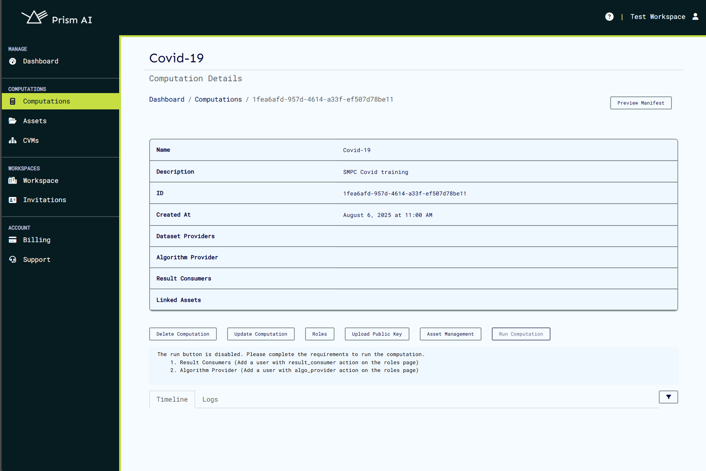
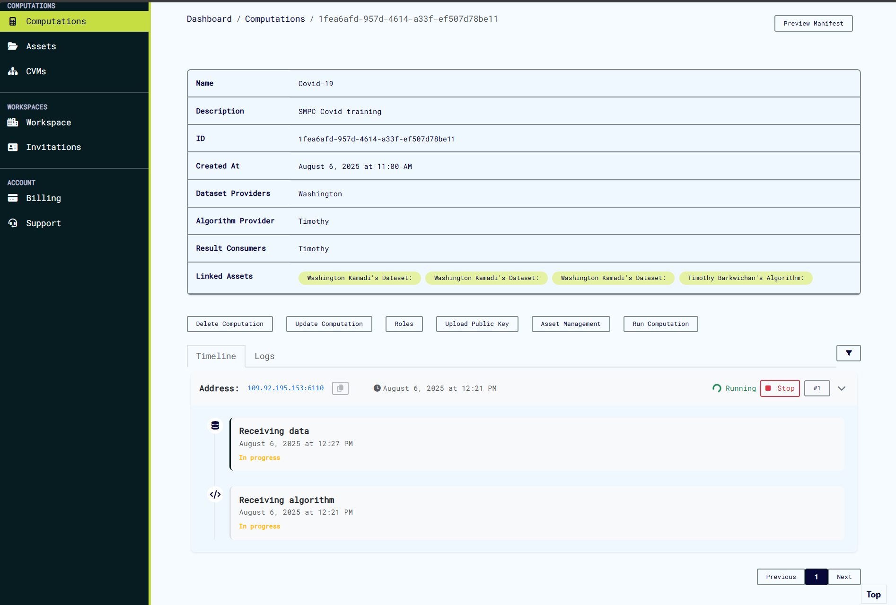
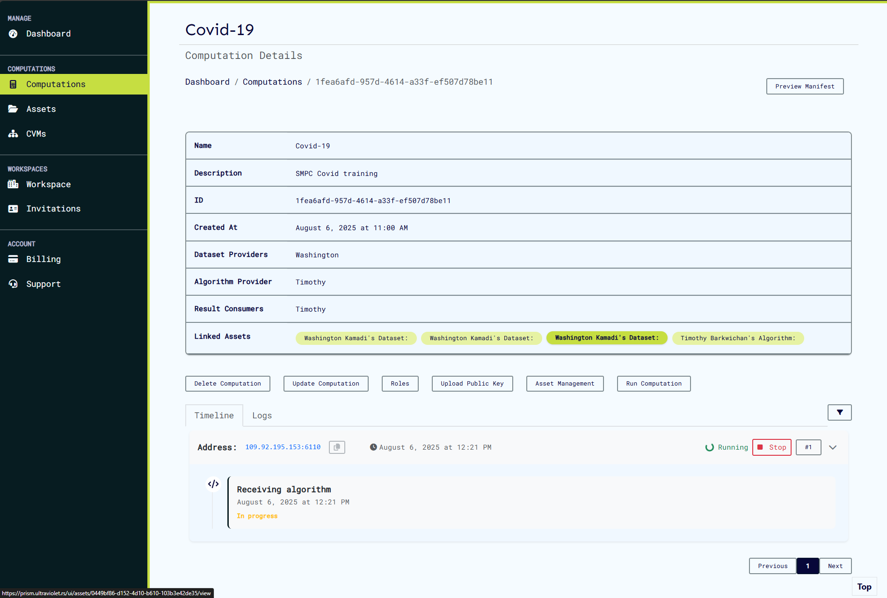
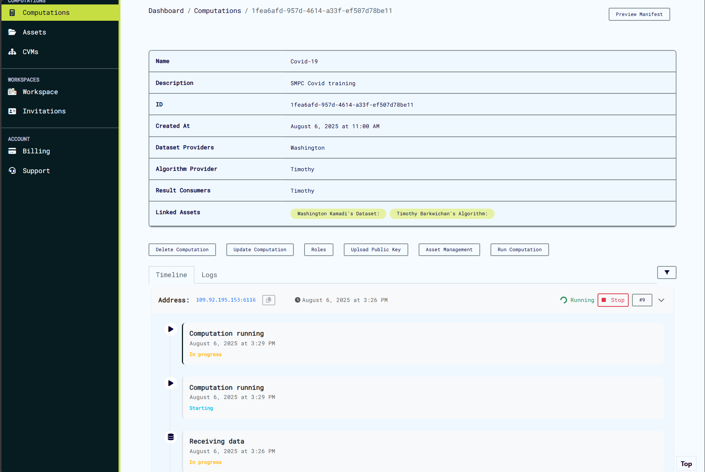
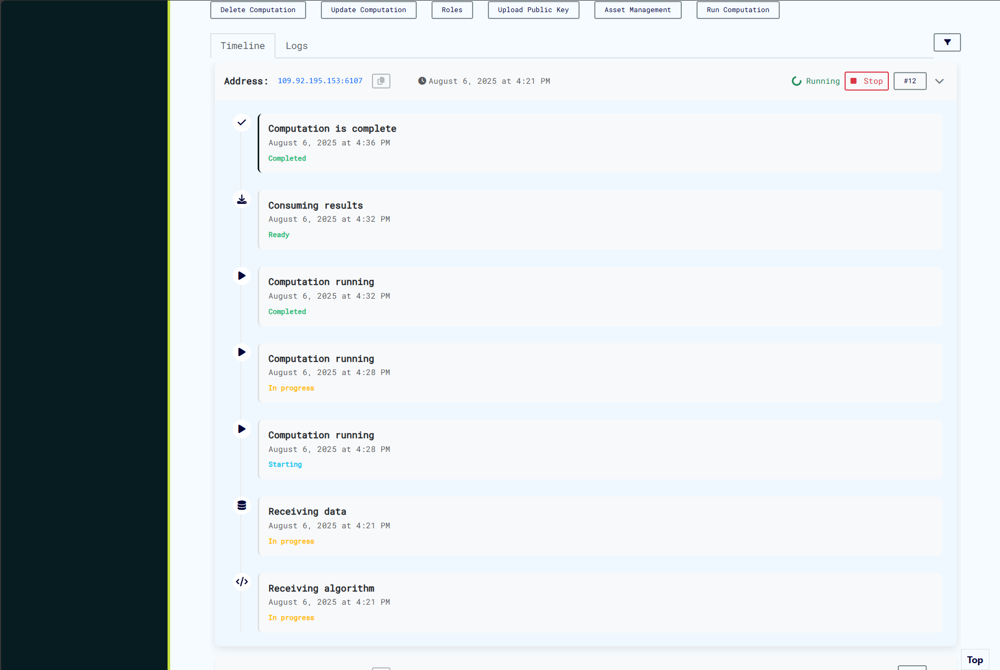

# Secure Multiparty Computation with Prism

This document presents a **real-world scenario** where Prism is used to perform a **secure multiparty computation (MPC)** for collaborative training of a COVID-19 prediction model. The use case demonstrates how **confidential data from multiple institutions** can be aggregated and processed without compromising data privacy.

While this example is grounded in pandemic response, the underlying approach generalizes to any sensitive, collaborative AI training effort — including applications in **healthcare, finance, and government**.

---

## 🌐 High-Level Use Case Context

Modern machine learning often requires diverse and high-quality datasets, but privacy, legal, and competitive concerns restrict data sharing. Prism addresses this by enabling **cross-organization AI training using secure enclaves** (Confidential Virtual Machines or CVMs), allowing data to remain private even during processing.

This COVID-19 use case highlights:

- **Collaborative AI training** without exposing raw datasets.
- **Compliance with data protection regulations** (e.g., HIPAA, GDPR).
- **Deployment of algorithms in secure compute environments**, fully auditable and cryptographically verified.

It builds on the COVID-19 training algorithm provided in the [AI repository](https://github.com/ultravioletrs/ai/tree/main/covid19) and executes it securely through Prism and the Cocos framework.

---

## Summary Workflow

1. **Provisioning**: Define a computation and onboard stakeholders.
2. **Asset Registration**: Upload datasets and algorithms securely.
3. **CVM Creation**: Set up confidential compute infrastructure.
4. **Execution**: Trigger and monitor the multiparty computation.
5. **Result Consumption**: Authorize and download final outputs.

---

## 1. Provisioning the Prism Environment

### Create the Workspace and Computation

- Set up a **workspace** as a secure collaboration boundary.
- Define a **computation** to encapsulate the training task.
- Ensure a valid **billing account** is attached for tracking usage.

📘 Refer to the [Getting Started Guide](/docs/getting-started.md) for setup instructions.



### Invite Participating Organizations

All participating institutions must:

- Be registered on Prism.
- Accept invitations to the workspace.
- Be assigned appropriate roles (e.g., **Asset Provider**, **Result Consumer**).

Each role enforces strict access control policies.



---

## 2. Registering Assets

### Uploading Datasets

Datasets must follow [AI repo guidelines](https://github.com/ultravioletrs/ai/tree/main/covid19#testing-with-cocos). Each dataset should:

- Be zipped and verified via checksum.
- Be uploaded using the CLI and linked to the computation.

Example:

```bash
./build/cocos-cli data ../ai/covid19/datasets/h1.zip ./private.pem
```

Repeat for all datasets.


### Uploading the Algorithm

Python-based training scripts should be uploaded with their dependencies:

```bash
./build/cocos-cli algo ../ai/covid19/train.py ./private.pem \
  -a python \
  -r ../ai/covid19/requirements.txt
```


The algorithm must conform to the Cocos runtime interface (as detailed in the AI repo).



---

## 3. Confidential Compute via CVM

CVMs are secure environments where the algorithm executes under **hardware-based encryption** (Intel SGX, AMD SEV, etc.).

Steps:

1. Go to the **CVMs** page and click **New CVM**.
2. Complete the required configuration.


📘 Detailed setup instructions: [CVM Docs](/docs/cvms.md)

After creation, export the CVM's gRPC endpoint:

```bash
export AGENT_GRPC_URL=192.0.2.1:6110
```

This allows CLI interaction with the agent.

---

## 4. Execution of the Secure Computation

Once all assets are in place:

1. Return to the **Computations** dashboard.
2. Click **Run** and select the target CVM.
3. Monitor the computation state in real time.

The computation will transition through:

- **Waiting for Algorithm**
- **Waiting for Datasets**
- **Running**
- **Completed**



All events and logs are cryptographically signed and verifiable.



---

## 5. Result Retrieval and Post-Processing

Authorized users can retrieve results via:

```bash
./build/cocos-cli result ./private.pem 
```


Note: Results are **one-time consumable** and linked to access control lists defined by the computation owner.



---

## 🔍 Broader Real-World Applications

This COVID-19 training use case serves as a **template for broader domains**:

| Domain        | Use Case Example                                                     |
|---------------|----------------------------------------------------------------------|
| **Healthcare** | Secure joint training of diagnostic models across hospitals.        |
| **Finance**    | Fraud detection models using data from multiple banks.              |
| **Insurance**  | Risk modeling across industry consortia.                            |
| **Energy**     | Demand forecasting using proprietary utility data.                  |
| **Public Sector** | Secure census or mobility analysis across government bodies.     |

Prism, powered by [Cocos](https://docs.cocos.ultraviolet.rs), makes **confidential AI collaboration** practical at scale, with cryptographic audit trails and privacy guarantees.

---

## 🔗 References

- [AI COVID-19 Training Repo](https://github.com/ultravioletrs/ai/tree/main/covid19)
- [Cocos CLI Docs](https://docs.cocos.ultraviolet.rs/cli)
- [Prism Getting Started Guide](/docs/getting-started.md)
- [CVM Reference Manual](/docs/cvms.md)
