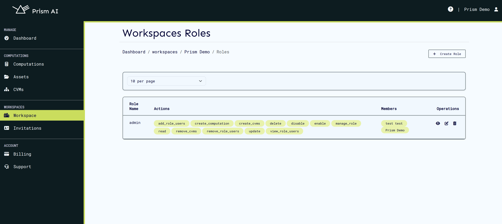
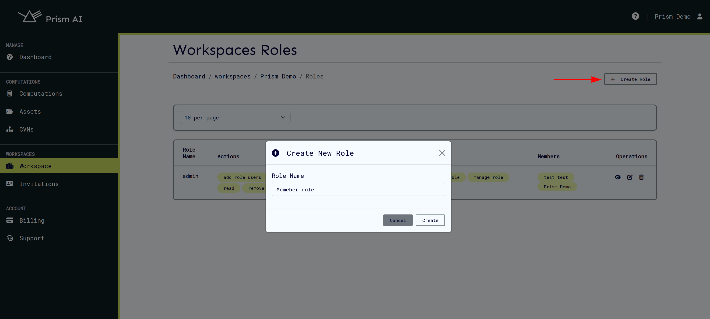
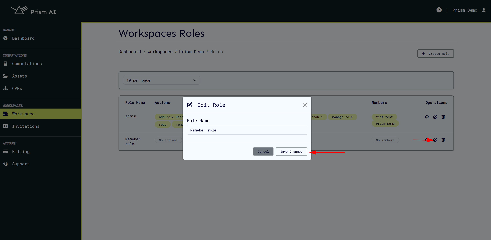
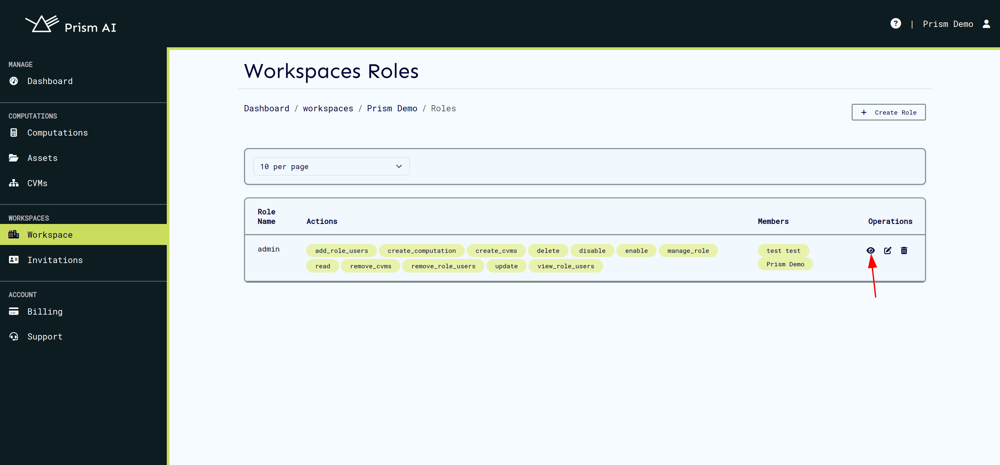
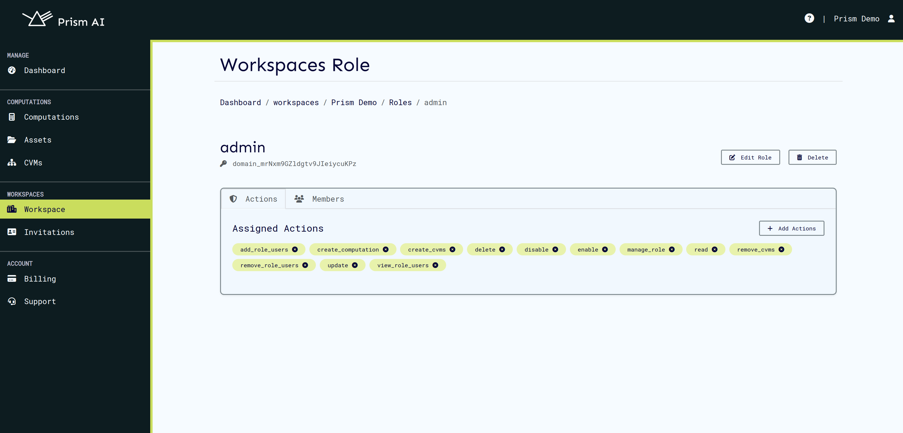
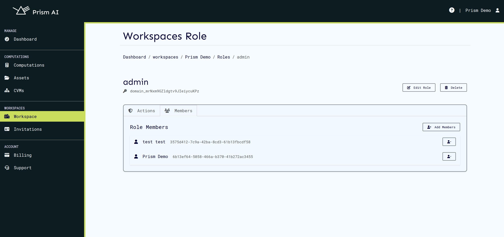
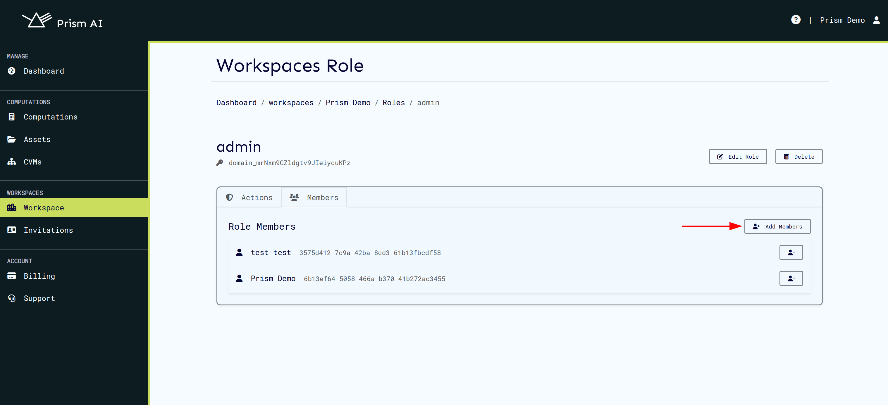
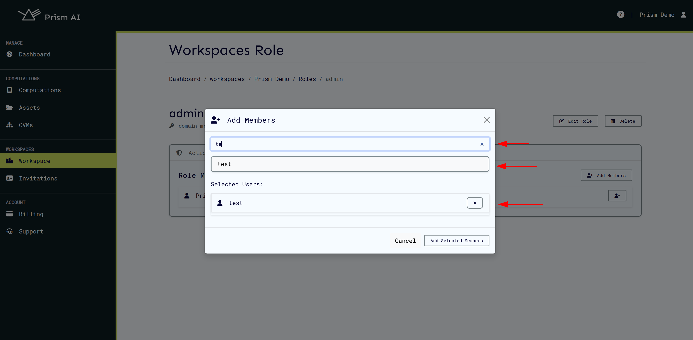
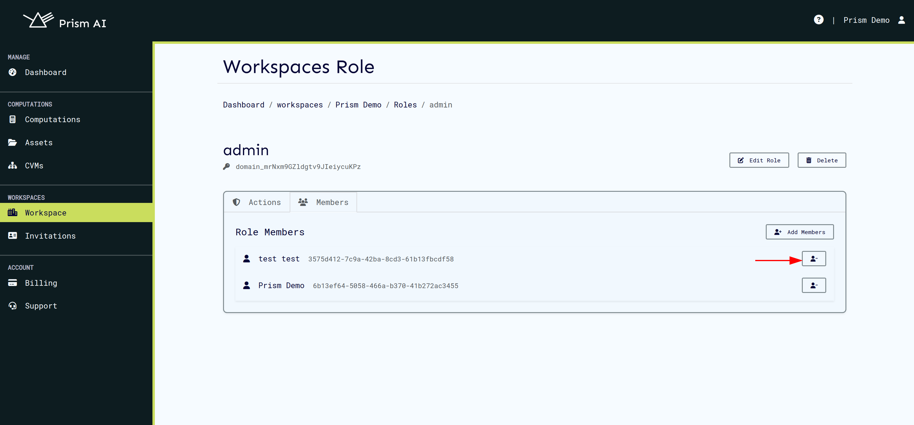
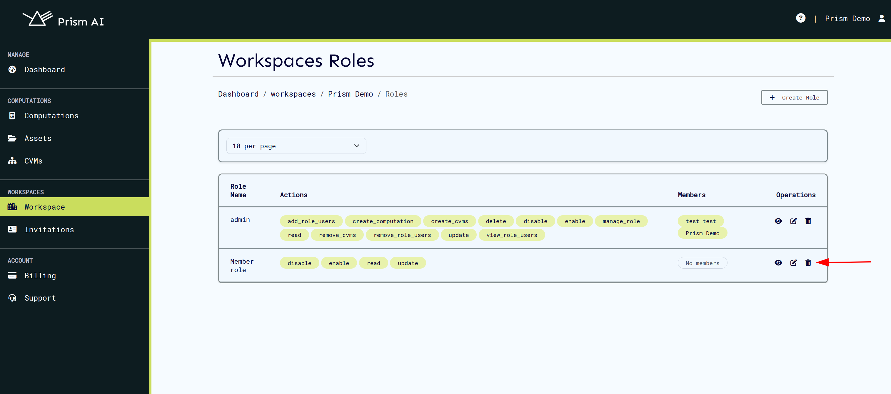

# Roles

## Workspace Roles

Workspace roles are used to manage user actions to a workspace. On service start, builtin roles are created with their associated actions which can be assigned to a user on a particular workspace. These builtin roles can be updated, deleted, and new ones added.

The following builtin roles are created on service initialization:

| Built-in Role | Actions                                                                                                                                              |
| ------------- | ---------------------------------------------------------------------------------------------------------------------------------------------------- |
| Admin         | add_role_users, create_computation, create_cvms, delete, disable, enable, manage_role, read, remove_cvms, remove_role_users, update, view_role_users |

## Role Management

### Overview

Role management is a critical component of access control in workspaces. Each role defines a set of actions a user is permitted to perform, ensuring that users have only the necessary actions for their responsibilities.

A key constraint in the role system is that **a user can only belong to a single role at a time**. If multiple actions from different roles are required, an existing builtin role can be updated to include these actions, or a **[new custom role](#Creating a Role)** can be created with those combined actions.

Builtin roles provide the most basic roles with single actions that can be updated or added depending on the user's requirements.

### Role Purpose in Workspace

Roles are essential in governing who can interact with a workspace and how. In the workspace, assigned roles determine access to various resources, such as CVMs creations. Each role is mapped to a set of predefined actions that enforce security and operational boundaries within a workspace.

### Accessing Role Management

To manage roles, follow these steps:

1. Navigate to the **Workspace** page.
2. Click the **Roles** button to manage user roles.

Clicking the **Roles** button will display all predefined built-in roles and their associated actions.

### Built-in Roles and Their Actions

The system provides predefined **built-in roles**, each granting specific access levels. The available built-in roles and their associated actions are:

| Built-in Role | Actions                                                                                                                                              | Description                                                             |
| ------------- | ---------------------------------------------------------------------------------------------------------------------------------------------------- | ----------------------------------------------------------------------- |
| **Admin**     | add_role_users, create_computation, create_cvms, delete, disable, enable, manage_role, read, remove_cvms, remove_role_users, update, view_role_users | Full control over the workspace, including modifying roles and actions. |

### Explanation of Actions

Each action in a role defines what the user can do:

- **read** – Allows the user to view workspace details but not modify them.
- **delete** – Grants the ability to modify workspace properties.
- **create_cvms** – Enables creation of a CVM.
- **remove_cvms** – Enables removal of a CVM.
- **add_role_users** – Allows the user to add user roles.
- **update** – Grants the ability to modify workspace properties.
- **view_role_users** – Allows the user to see user roles but not modify them.
- **remove_role_users** – Allows the user to remove user roles but not modify them.
- **manage_role** – Allows the user to manage roles such as addition of actions.
- **create_computation** – Enables creation of a computation.
- **disable** – Allows the user to disable resources.
- **enable** – Allows the user to enable resources.

## Managing Roles

### Creating a Role

To create a role, the following steps can be followed.

1. Click the **Create Role** button.
2. Define the role name and select the required actions.
3. Save the role to make it available for assignment.

### Updating a Role

Existing roles can be modified if actions need to be adjusted.

1. Click the **Update Role** button next to the role.
2. Modify the role’s name or actions.
3. Save the changes to update the role.

### Viewing Role Details

To see details about a role, including its assigned actions and members, click the **View Role** button.

This will display:

- **Role Actions** – The actions assigned to the role.
- **Role Members** – A list of users assigned to this role.

  

## Managing Users in Roles

### Adding a User to a Role

Since a user can only have one role at a time, ensure that the assigned role includes all necessary actions.

1. Click the **Add Members** button.
2. Select users to assign to the role.
3. Confirm the selection.

  

### Removing a User from a Role

To revoke access, remove a user from a role:

1. Navigate to the role’s details page.
2. Locate the user in the **Role Members** section.
3. Click the **Remove** button.

## Deleting a Role

Roles that are no longer needed can be removed. **Note:** Deleting a role will revoke access for all assigned users.

1. Click the **Delete Role** button next to the role.
2. Confirm the deletion.

